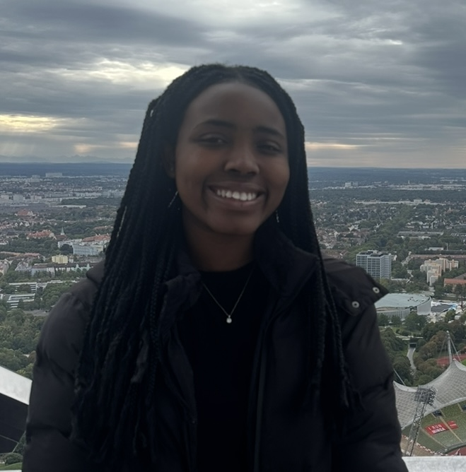

## {.circular-image}

### My Journey 

I was born and raised in Ireland, with roots tracing back to Nigeria on both sides of my family. Growing up in a multilingual environment sparked my fascination with languages early on, which influenced the path I chose in terms of education. In secondary school, I gravitated towards business and French as my favourite subjects, one of which became a key area of focus in my academic journey.

Building on this foundation, I wanted to take on a new challenge in university by choosing **German** as part of my degree in Business Studies International. Four years later, I'm proud to have expanded my language skills and knowledge, and I'm now preparing for the next milestone, earning my **C1** certification in German to indicate my proficiency. To learn more about my initial thoughts on Erasmus, please click [here](blog/first-ref.qmd)!

During my university years, I did what I could to increase my knowledge of **data analytics** and **programming**. Whether that included completing extra Kubicle courses outside of the module's requirements or signing up for the Harvard Cs50x course, nothing would stop me! I want to apply what I've learned in multicultural contexts. I want to use what I've learned to help people and inspire them that it's possible to follow your ambitions, no matter how difficult it may seem.

---

### My Skills 

During my degree, I became familiar with programs such as **Excel**, **Python**, **Power BI** and more. I genuinely enjoy using them to capture strong insights that can help people and add any sort of value. Click on each tool to access a project I have applied it to! The meter represents my proficiency in each program.

[**Power BI: Consulting an Automobile Company**](projects1/powerbi.qmd)  

[**The Importance of Customer Recommendations: Python**](projects1/recommendation.qmd)  

[**The Movie Industry and Success: SQL**](projects1/sqlmovie.qmd)  

---

### My CV 

To view my CV in English, click [here](english-cv.pdf).

For the German version, click [here](german-cv.pdf)!

If there is a preference to download them directly, **please use the links below** to do so:

* <a href="english-cv.pdf" download> Download English Version</a>

* <a href="german-cv.pdf" download> Download German Version</a>

---

### Hobbies & Interests 
Outside of academia, I find ways to communicate in more languages! It may sound intense, but it is true! I love everything related to culture, travelling and language learning. It's incredibly fun, and it is not just a way to learn about others but yourself, making you a more well-rounded person in my book. Hence, I chose this degree and studied in [Munich](https://www.tum.de/en/) during my third year! Although stressful and overwhelming at times, it was enriching. I love language learning and all the tribulations that may come with it! In four years, I have not only studied through **German** but am en route to getting my **C1 Goethe Institut** certificate soon! 

Despite not choosing French with my degree, I still try to learn it when I have time! Language learning is one of my big interests, so I have made some effort to keep up with it! I will admit that a lot of my speaking ability is gone, but I can comprehend the context and do enjoy reading simple texts in the language!

Furthermore, I enjoy music and dance! To keep fit, I practice choreography and have visited hip-hop dance classes in the past! 

---

### Achievements 

* Senior Student of the Year [2021] - Ardscoil La Salle. 

* Leaving Cert Points: **565** (All higher level subjects).

* **Studied through German** at the Technical University of Munich (Year long Erasmus), now working towards a C1 German certification.

* Worked part-time in customer-facing roles in both English and German, expanding my **ability to work in multilingual contexts**.

* Kubicle certificates include **Excel** PivotTables, Lookups, and database functions, as well as creating visualisations in **Tableau**.

<!-- Circular image to scss idea, meter bar and download CV function - coding assistance with ChatGPT-->
<!-- Layout style inspired by Damien Dupre's "About" Page. Available here: https://damien-dupre.github.io/about.html-->
<!-- Font Awesome extension used. Available here: https://fontawesome.com/search?q=work&o=r&s=solid&ip=classic-->