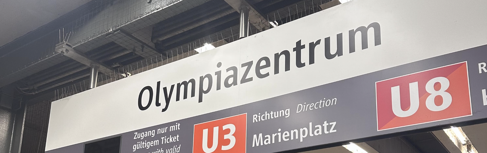
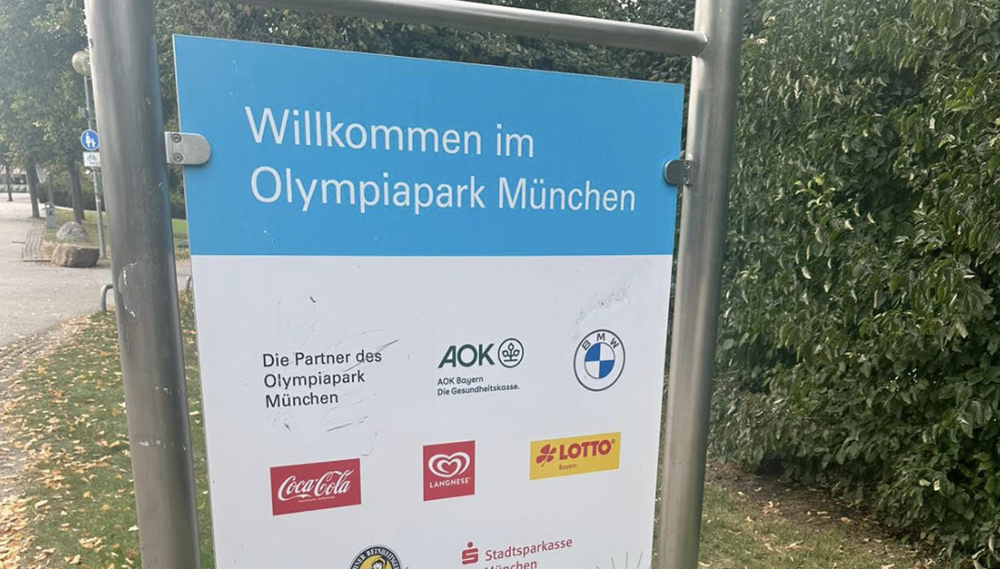

::: {.callout-note collapse="true"}
## The reasoning behind displaying this?

* It shows my ability to reflect back on past experiences critically, a transferable skill which I can for sure use in the work place.

* It shows that at the beginning, whilst they were bumps, I learned from them and this in turn made me a more understanding person. 

* It proves that I have attended university through the German language, showing my linguistic proficiency. 

:::

## Deutsch ist eine schwierige Sprache, oder? (German is a hard language, right?)
## 

One cannot describe an experience in Germany without alluding to the infamous difficulty followed by the language. Disregarding the obvious, the German language hugely differs from what we are taught in the classroom. The language is exceptionally beautiful but Spikers-Shaw (2014) mirrored my feelings of deflated confidence after exposure to his country’s respective language. Like every other native language speaker they tend to abbreviate their words, drop vowels etc. In turn, as a language learner, it can feel as though you’ll never learn or adapt.

Meyer (2014) stated that “erroneous assumptions” can come from stereotyping, which I concur with. As I imagined a diverse and lively city, while comparing it to Dublin, I expected colder and far more impatient people. Intercultural modules in the past, posed Germany as a more direct society; I believed that this translated to a certain unforgivingness as I improperly used the language (Thesing, 2016). 

Using an example which occurred during my first few days upon arrival, I was unsure about the Deutschland ticket system. To be safe, I wanted to purchase a day pass. Unaware of how the machines worked, I built up the courage to approach a young woman, hoping she would help me. My go-to sentence before anything else was “Sprechen Sie Englisch?”, only to be met with a “Leider nicht, nur Deutsch.” I was forced to use the language, granted my German was broken and unconfident, she helped me and even went as far as to show me which buttons to press on the machine. That one interaction has now jump-started my ability to ask strangers for help through German, therefore increasing my speaking confidence with the language. 

## Ungeschriebene Regeln (unwritten rules)
Unwritten rules exist wherever you are in the world; they provide a sense of culture, community and understanding, laying the foundation for what is acceptable behaviour (Misyak et al., 2014). 

An evident example is standing on the right-hand side of the escalator and only walking on the left-hand side. I received a few “Kann ich vorbei” in a slightly annoyed tone due to unknowingly standing in the way. It added to the overall anxiety coming with such a big change but it amuses me now when it flashes through my mind. In comparison to Ireland, people tend to stand anywhere they please on the escalator, getting through requires a polite but overall shove. It is entertaining to compare the two countries to see how one little gesture can make all the difference in someone else’s day.

## 
## Letzte Gedanken (Conclusion/Final thoughts)
In conclusion, there has been a slight rockiness to my start here but Munich is a beautiful city. I have had the privilege of visiting some famous landmarks such as the Residenz and the Olympia Tower. I visited these landmarks with other international students with platforms made available through my school. It has been delightful getting acquainted and understanding that everything which I am going through, they’re all likely facing as well. Despite socializing, I worry about falling victim to the Erasmus-Blase (bubble). I try to counteract these thoughts by keeping in mind that I am still attempting to find my footing, as time progresses I know my mind as well as my horizons will have broadened (Harry, 2015). 

**Click [here](last-ref.qmd) to access my final reflection!**

## References
* Harry, J. (2015) What nobody tells you about studying abroad, The Guardian. Available at: [https://www.theguardian.com/education/2015/jun/17/what-nobody-tells-students-about-studying-abroad](https://www.theguardian.com/education/2015/jun/17/what-nobody-tells-students-about-studying-abroad) [Accessed 14 October 2023].

* Meyer, E. (2014) ‘Navigating the Cultural Minefield’, Harvard Business Review , 92(5), pp. 119–123. 

* Misyak, J.B. et al. (2014) ‘Unwritten rules: Virtual bargaining underpins social interaction, culture, and Society’, Trends in Cognitive Sciences, 18(10), pp. 512–519. doi:10.1016/j.tics.2014.05.010 

* Spijkers-Shaw, S. (2014) What I’ve learned from studying abroad, The Guardian. Available at: [https://www.theguardian.com/education/mortarboard/2014/may/06/students-study-abroad-tips](https://www.theguardian.com/education/mortarboard/2014/may/06/students-study-abroad-tips) [Accessed 14 October 2023].

* Thesing, C. (2016) ‘Intercultural Communication in German-Dutch business contexts’, Oapen.org [Preprint]. doi:10.31244/9783830985532  

<!--Images used in header and throughout this page were taken by me.-->