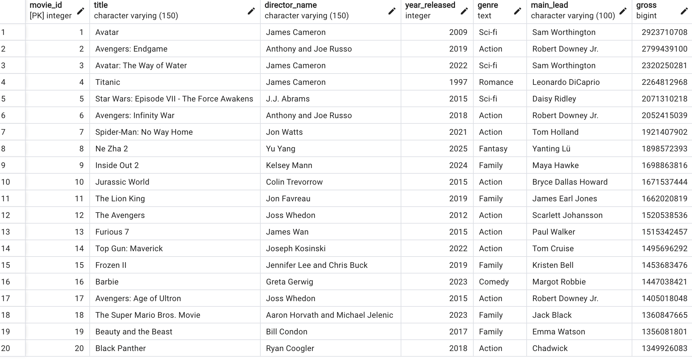
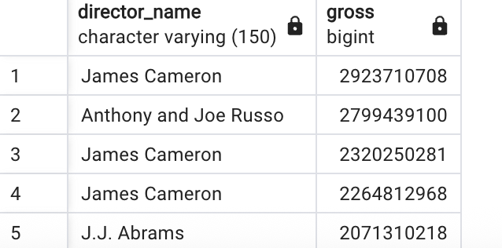
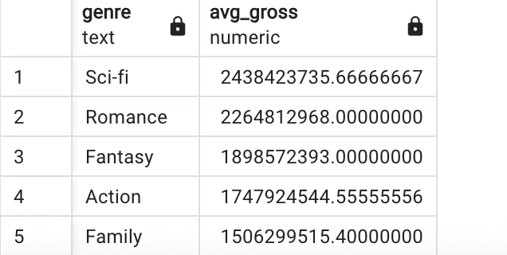
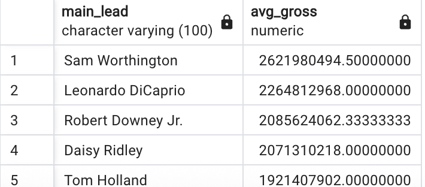
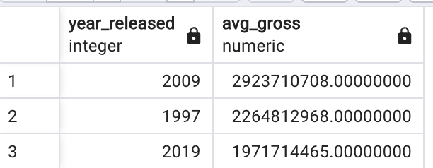

> Similar to what Netflix would have done in terms of a "data-driven" approach to create the successful show “House of Cards”, this SQL project follows the same idea [^1]. I will create a theoretical dataset which involves movie titles, directors, what they grossed, etc and query them to determine what specific component may have played a significant part in their success. 

> Using the list from the Box Office Mojo [^2], I manually created tables with some headings. The code for this project is adapted from Medium's article [^3] using movies and their databases.

::: {.callout-tip}
## What was derived?
* 2009 produced one of the most sucessful movies, including Avatar which ranked the highest in gross income; this also went on as a series. 

* Most popular genre which grossed the highest was Sci-fi, showcasing the financial impact of a good science fiction storyline such as Avatar and Star Wars.

* Popular directors such as James Cameron (Director of Avatar and Titanic) and Anthony and Joe Russo (Avengers) bring the largest revenue in regards to films.

:::

### Creating Table for Movies
```{sql}
CREATE TABLE movies (
movie_id INT PRIMARY KEY, 
title VARCHAR (150),
director_name VARCHAR (150),
year_released INT, 
genre TEXT,
main_lead VARCHAR (100)
);
```

### Inserting Values from Box Office Mojo's Website
```{sql}
INSERT INTO movies (movie_id, title, director_name, year_released, genre, main_lead)
VALUES (1, 'Avatar', 'James Cameron', 2009, 'Sci-fi', 'Sam Worthington');

INSERT INTO movies (movie_id, title, director_name, year_released, genre, main_lead)
VALUES (2, 'Avengers: Endgame', 'Anthony and Joe Russo', 2019, 'Action', 'Robert Downey Jr.');

INSERT INTO movies (movie_id, title, director_name, year_released, genre, main_lead)
VALUES (3, 'Avatar: The Way of Water', 'James Cameron', 2022, 'Sci-fi', 'Sam Worthington');

INSERT INTO movies (movie_id, title, director_name, year_released, genre, main_lead)
VALUES (4, 'Titanic', 'James Cameron', 1997, 'Romance', 'Leonardo DiCaprio');

INSERT INTO movies (movie_id, title, director_name, year_released, genre, main_lead)
VALUES (5, 'Star Wars: Episode VII - The Force Awakens', 'J.J. Abrams', 2015, 'Sci-fi', 'Daisy Ridley');

INSERT INTO movies (movie_id, title, director_name, year_released, genre, main_lead)
VALUES (6, 'Avengers: Infinity War', 'Anthony and Joe Russo', 2018, 'Action', 'Robert Downey Jr.');

INSERT INTO movies (movie_id, title, director_name, year_released, genre, main_lead)
VALUES (7, 'Spider-Man: No Way Home', 'Jon Watts', 2021, 'Action', 'Tom Holland');

INSERT INTO movies (movie_id, title, director_name, year_released, genre, main_lead)
VALUES (8, 'Ne Zha 2', 'Yu Yang', 2025, 'Fantasy', 'Yanting Lü');

INSERT INTO movies (movie_id, title, director_name, year_released, genre, main_lead)
VALUES (9, 'Inside Out 2', 'Kelsey Mann', 2024, 'Family', 'Maya Hawke');

INSERT INTO movies (movie_id, title, director_name, year_released, genre, main_lead)
VALUES (10, 'Jurassic World', 'Colin Trevorrow', 2015, 'Action', 'Bryce Dallas Howard');

INSERT INTO movies (movie_id, title, director_name, year_released, genre, main_lead)
VALUES (11, 'The Lion King', 'Jon Favreau', 2019, 'Family', 'James Earl Jones');

INSERT INTO movies (movie_id, title, director_name, year_released, genre, main_lead)
VALUES (12, 'The Avengers', 'Joss Whedon', 2012, 'Action', 'Scarlett Johansson');

INSERT INTO movies (movie_id, title, director_name, year_released, genre, main_lead)
VALUES (13, 'Furious 7', 'James Wan', 2015, 'Action', 'Paul Walker');

INSERT INTO movies (movie_id, title, director_name, year_released, genre, main_lead)
VALUES (14, 'Top Gun: Maverick', 'Joseph Kosinski', 2022, 'Action', 'Tom Cruise');

INSERT INTO movies (movie_id, title, director_name, year_released, genre, main_lead)
VALUES (15, 'Frozen II', 'Jennifer Lee and Chris Buck', 2019, 'Family', 'Kristen Bell');

INSERT INTO movies (movie_id, title, director_name, year_released, genre, main_lead)
VALUES (16, 'Barbie', 'Greta Gerwig', 2023, 'Comedy', 'Margot Robbie');

INSERT INTO movies (movie_id, title, director_name, year_released, genre, main_lead)
VALUES (17, 'Avengers: Age of Ultron', 'Joss Whedon', 2015, 'Action', 'Robert Downey Jr.');

INSERT INTO movies (movie_id, title, director_name, year_released, genre, main_lead)
VALUES (18, 'The Super Mario Bros. Movie', 'Aaron Horvath and Michael Jelenic', 2023, 'Family', 'Jack Black');

INSERT INTO movies (movie_id, title, director_name, year_released, genre, main_lead)
VALUES (19, 'Beauty and the Beast', 'Bill Condon', 2017, 'Family', 'Emma Watson');

INSERT INTO movies (movie_id, title, director_name, year_released, genre, main_lead)
VALUES (20, 'Black Panther', 'Ryan Coogler', 2018, 'Action', 'Chadwick');
```

### Creating a "gross" column for financial aspect

```{sql}
CREATE TABLE gross_amount1(
gross_id INT PRIMARY KEY, 
gross BIGINT
);
```

### Inserting respective values 

```{sql}
INSERT INTO gross_amount1 (gross_id, gross)
VALUES (1, 2923710708);

INSERT INTO gross_amount1 (gross_id, gross)
VALUES (2, 2799439100);

INSERT INTO gross_amount1 (gross_id, gross)
VALUES (3, 2320250281);

INSERT INTO gross_amount1 (gross_id, gross)
VALUES (4, 2264812968);

INSERT INTO gross_amount1 (gross_id, gross)
VALUES (5, 2071310218);

INSERT INTO gross_amount1 (gross_id, gross)
VALUES (6, 2052415039);

INSERT INTO gross_amount1 (gross_id, gross)
VALUES (7, 1921407902);

INSERT INTO gross_amount1 (gross_id, gross)
VALUES (8, 1898572393);

INSERT INTO gross_amount1 (gross_id, gross)
VALUES (9, 1698863816);

INSERT INTO gross_amount1 (gross_id, gross)
VALUES (10, 1671537444);

INSERT INTO gross_amount1 (gross_id, gross)
VALUES (11, 1662020819);

INSERT INTO gross_amount1 (gross_id, gross)
VALUES (12, 1520538536);

INSERT INTO gross_amount1 (gross_id, gross)
VALUES (13, 1515342457);

INSERT INTO gross_amount1 (gross_id, gross)
VALUES (14, 1495696292);

INSERT INTO gross_amount1 (gross_id, gross)
VALUES (15, 1453683476);

INSERT INTO gross_amount1 (gross_id, gross)
VALUES (16, 1447038421);

INSERT INTO gross_amount1 (gross_id, gross)
VALUES (17, 1405018048);

INSERT INTO gross_amount1 (gross_id, gross)
VALUES (18, 1360847665);

INSERT INTO gross_amount1 (gross_id, gross)
VALUES (19, 1356081801);

INSERT INTO gross_amount1 (gross_id, gross)
VALUES (20, 1349926083);
```

### Joining gross table to main movie table 
```{sql}
SELECT * from gross_amount1

ALTER TABLE movies 
ADD COLUMN gross BIGINT;

ALTER TABLE movies
DROP COLUMN gross_id;

SELECT * from movies

UPDATE movies m
SET gross = g.gross
FROM gross_amount1 g
WHERE m.movie_id = g.gross_id;
```

### The formulated table



## Seeing which movie ranked highest 
```{sql}
SELECT title, gross
FROM movies
ORDER BY gross DESC
LIMIT 1;
```

## Seeing which director ranked highest
```{sql}
SELECT director_name, gross
FROM movies
ORDER BY gross DESC
Limit 5;
```


## Average gross across genre
```{sql}
SELECT genre, AVG(gross) AS avg_gross
FROM movies
GROUP BY genre 
ORDER BY avg_gross DESC;
```


## Average income according to actors
```{sql}
SELECT main_lead, AVG(gross) AS avg_gross
FROM movies
GROUP BY main_lead 
ORDER BY avg_gross DESC
LIMIT 5;
```


## Average income according to year
```{sql}
SELECT year_released, AVG(gross) AS avg_gross 
FROM movies
GROUP BY year_released 
ORDER BY avg_gross DESC
LIMIT 3;
```


::: {.callout-note collapse="true"}
### The conclusion / takeaway
* Like Netflix’s strategy with House of Cards, production studios can combine proven elements, like visionary directors and high-performing genres, to consistently deliver top-grossing films.

* This project isn't just about writing SQL; it reflects my ability to draw insight from data and communicate meaningful conclusions. That analytical mindset is something I’ll bring into every future role.
:::

[^1]: [Explanation: Netflix's House of Cards](https://medium.com/@danial.a/how-netflix-used-data-to-create-house-of-cards-a-revolutionary-approach-to-content-creation-b9a114630ddc)

[^2]: [Box Office Mojo](https://www.boxofficemojo.com/chart/top_lifetime_gross/?area=XWW)

[^3]: [Article which code is adapted from](https://medium.com/%40DylanAttal/learning-sql-making-a-movie-library-dba011182246)

## Sourcing for code from following websites as well as footnotes below.


* [SQL Averaging](https://hightouch.com/sql-dictionary/sql-avg)
* [Order By Checking](https://www.w3schools.com/sql/sql_orderby.asp)
* [UPDATE and SELECT statements](https://www.sqlshack.com/how-to-update-from-a-select-statement-in-sql-server/)
* [Coding assistance - ChatGPT](https://chatgpt.com/)


<!--Image for header from Unsplash by: Felix Mooneeram
Available at: https://unsplash.com/photos/red-cinema-chair-evlkOfkQ5rE-->